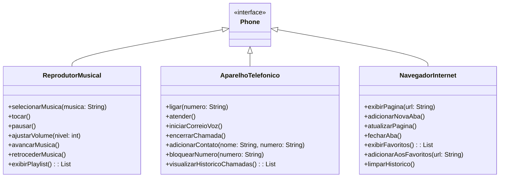

# 🚀 Desafio DIO: Modelagem UML do iPhone 2007

## 🎯 Objetivo do Projeto

Este projeto visa capturar a essência inovadora do primeiro iPhone através de uma representação UML precisa, inspirada diretamente no marco histórico de seu lançamento. O diagrama reflete as três revoluções tecnológicas que Steve Jobs apresentou ao mundo em 9 de janeiro de 2007.

## 🔍 Visão Geral do Diagrama  
Este projeto modela três componentes principais do iPhone:  

1. **🎵 Reprodutor Musical** – Controle de músicas e playlists.  
2. **📞 Aparelho Telefônico** – Gestão de chamadas e contatos.  
3. **🌐 Navegador na Internet** – Navegação web e histórico.  

## 💬 Citação Emblemática

> "Não são três dispositivos separados - é um único dispositivo. E nós o chamamos de iPhone."  
> **Steve Jobs, Macworld 2007**

## 📊 Diagrama UML  

## ▶️ Vídeo Referência que inspirou esse Projeto
- [[Steve Jobs apresenta o iPhone]](https://www.youtube.com/watch?v=9ou608QQRq8 "Assistir ao lançamento completo")

## 📚 Ferramenta Utilizada
- [[Mermaid]](https://www.mermaidchart.com/app/projects)

